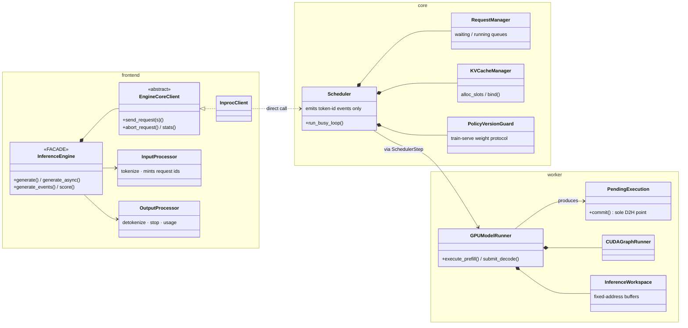

# Inference Engine Internals

The inference engine follows the vLLM v1 layering — as **three one-way
in-process layers** (no process boundary: colocated RL rollout shares the
model object with the trainer, which `PolicyVersionGuard` depends on):

```text
astrai/inference/
  frontend/   engine facade · input/output processors · events · core client
  core/       scheduler · request lifecycle · KV accounting · versioning
  worker/     model runner · pending steps · CUDA graphs · sampler · workspace
  network/    OpenAI/Anthropic protocol adapters (frontend deployment)
```

Dependency rule, enforced by import direction:
**frontend → core → worker → model/KV ABI**. The worker's only dependency
on the core is a `TYPE_CHECKING` type reference (it consumes the KV
manager's `bind()` interface); the core never imports the frontend at
runtime (events live in `core/events.py` and are re-exported).

## Folder contents

| Document | Scope |
|----------|-------|
| [frontend.md](frontend.md) | `InferenceEngine`, `InputProcessor`, `OutputProcessor`, `EngineCoreClient`, the output-event contract |
| [core.md](core.md) | `Scheduler` busy loop, `RequestManager`, `SchedulerStep`, `KVCacheManager`/`BlockPool`, `PolicyVersionGuard` |
| [worker.md](worker.md) | `GPUModelRunner`, `PendingExecution` (submit/commit), `CUDAGraphRunner`, `ResultRing`, `SamplingPipeline`, `InferenceWorkspace` |
| [events.md](events.md) | The event flow end-to-end (sequence diagram), request state machine, design-pattern view |

## Layer overview



## Naming

Class names follow vLLM v1 where the concept is the same
(`Scheduler`, `Request.num_computed_tokens`, `KVCacheManager`,
`GPUModelRunner`, `run_busy_loop`). AstrAI-only concepts keep their names
(`PolicyVersionGuard`, `InferenceEngine`, `SchedulerStep` — the latter
merges into `schedule()`/`update_from_output()` when the scheduler-output
data contract lands). See the repo-root design document
(`astrai-inference-refactor-design.md`) for the full rename map and the
deliberate non-goals (no EngineCore process, no ZMQ, no mixin towers).

## Status of known gaps

The layering above is the implemented structure (commit `1c59adb`).
Behavior-level work still open: token-budget scheduling with chunked
prefill (decode currently waits behind full prefills), `stop()` race
hardening, and routing the production `BlockPool` construction through
`PagedStrategy` + `RadixCache` (the paged path is implemented and tested
but not selected by default constructors).
