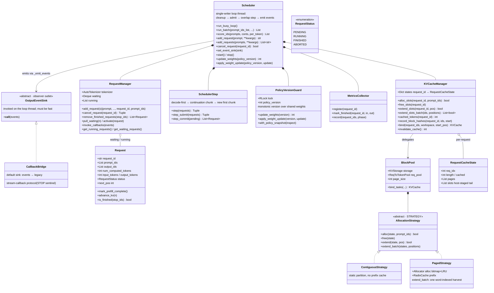

# Core Layer

`astrai/inference/core/` — the engine core (vLLM analogue: the
EngineCore process's scheduler + KV accounting; here a single-writer
loop thread in-process). The core emits output events; it never
detokenizes and never runs consumer callbacks.

## Classes

## The busy loop

`Scheduler.run_busy_loop` is a plain Python loop on its own thread (no
asyncio — the vLLM EngineCore discipline). Each iteration:

1. **cleanup** — `remove_finished_requests(stop_ids)`; a finished
   request whose KV is still written by the in-flight step is *retired*
   (slot freed next iteration, after the pending step commits);
2. **admit** — waiting requests get KV slots (`alloc_slots`);
3. **step** — steady decode batches ride the depth-2 submit/commit
   overlap pipeline (`enable_overlap`); any batch change drains first
   and falls back to the synchronous step;
4. **emit** — one `OutputEvent` batch per step: `TokenDelta` per
   committed token plus `RequestFinished`; no text, no callbacks.

## KV accounting

`KVCacheManager` is the facade the scheduler talks to; `BlockPool` owns
the physical buffers (`KVStorage` + `ReqToTokenPool`) and an
`AllocationStrategy`:

- **ContiguousStrategy** — static per-request partitions (the default
  constructor path; no prefix cache).
- **PagedStrategy** — dynamic pages from a bitmask allocator (word-index
  harvest for batched extends), optional `RadixCache` prefix index keyed
  by exact token-page edges. Only complete, materialized pages are
  shared; the final sampled token is excluded (not yet in KV).

`Request.num_computed_tokens` is the single scheduling state variable —
the vLLM model: every optimization (chunked prefill, prefix hits,
overlap) changes how it advances, not the scheduler's branches.

## Policy versioning

`PolicyVersionGuard` is the train-serve weight protocol (no vLLM
counterpart): weights are mutated in place under its RLock; versions are
monotonic; every commit invalidates cached KV produced by older weights
(`invalidate_cache`). Weight updates require the loop stopped and queues
drained (`_ensure_weight_update_ready`).
