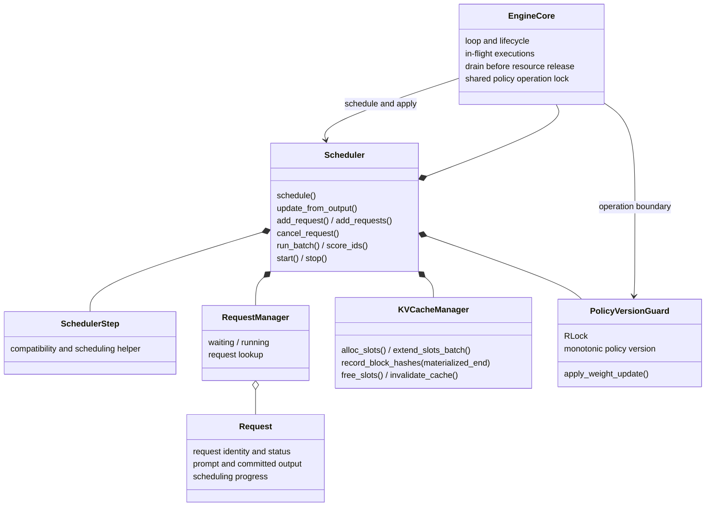

# Core Layer

`astrai/inference/core/` owns request lifecycle and logical KV accounting.
It runs in the same process as the model and trainer. The frontend receives
token-ID events; model execution consumes neutral data contracts.

## Driver versus scheduler

`EngineCore` coordinates the busy loop, in-flight execution, result draining,
shutdown and the shared operation boundary. `Scheduler` retains the public
facade used by serving and rollout, owns the request queues and KV manager,
and supplies scheduling and result-application operations.

The mutable `Request` belongs to the core. Planning captures an execution
snapshot; worker execution must not read a changing request or append to its
output. Result application validates execution/request identity and policy
version, then advances the corresponding live request. Reapplying a result
must not append the same token twice.

`SchedulerStep` is retained for internal compatibility. It does not justify
passing `Request` objects through the worker boundary, nor may it create a
second result-application path that bypasses request lifecycle rules.

## Execution and event ordering

A step has three distinct responsibilities:

1. **Plan:** choose request windows and reserve the required KV resources.
2. **Execute:** submit the immutable plan; preserve its association with all
   execution handles, including multiple backend groups.
3. **Apply:** materialize the result, match it by identity, update request
   state and emit accepted token/terminal events.

Controlled decode overlap can submit a later step before an earlier result
is applied. Therefore an optimistic scheduling cursor is not proof that all
its KV is complete, and it is not an output-token count. Cancellation and
EOS may cause an already-submitted token to be discarded. That execution
still has to retire before its pages, result slots or request slots are
reused.

A change in the running batch drains prior work through the same result
application and event path. Draining is not merely a synchronization call:
any accepted tokens produced by the drained executions must be delivered.
Stopping similarly drains or safely retires in-flight work before clearing
request/KV state. A timed-out join retains the live thread and its state;
a second loop must not be started over it.

## KV accounting

`KVCacheManager` owns request allocation state. `BlockPool` owns the physical
storage, token mapping and allocation strategy:

- **ContiguousStrategy:** static request partitions, no prefix reuse.
- **PagedStrategy:** logical pages from a bitmap/LRU allocator; radix prefix
  indexing is enabled for page sizes greater than one.

A decode token requires an updated token-to-slot mapping even if it needs no
new page. Page allocation and slot-map updates are separate operations.

Prefix publication requires
`record_block_hashes(..., materialized_end=exclusive_token_end)`. The boundary
must come from completed execution, not from prompt length, allocated page
count, or a cursor already advanced for a later in-flight step. Only complete
pages below that boundary can be published. The sampled token is not yet in
KV until a subsequent model execution consumes it.

Radix re-recording must preserve valid descendants, and removal of an
ancestor must not leave descendants advertised by the reverse index. Physical
allocator references and prefix-index reachability are separate invariants.

Both cache strategies preallocate a GPU arena. Paged allocation currently
reserves prompt pages at admission; chunking limits computation, not that
initial reservation. Global token budgets, progressive prompt allocation and
recompute preemption are not introduced by this ownership refactor.

## Policy versioning

`PolicyVersionGuard` remains the train/serve protocol: an RLock protects
in-place weight mutation and monotonically increasing versions. Every weight
commit invalidates KV from older weights. Execution plans carry the actual
version; a stale result cannot be applied as a new-version token.

Generation, scoring, admission and weight mutation use the same operation
boundary. Weight mutation requires a stopped/drained engine with no queued
requests. Colocated rollout holds the snapshot boundary around eval-mode
entry, generation and restoration. Replica publishers enter the receiving
backend's mutation boundary **before** copying weights, rather than copying
first and validating the version afterward.

No process boundary or model copy is added for colocated rollout. Existing
`run_batch` token/logprob results and the policy-version API remain the
training-facing interface.
