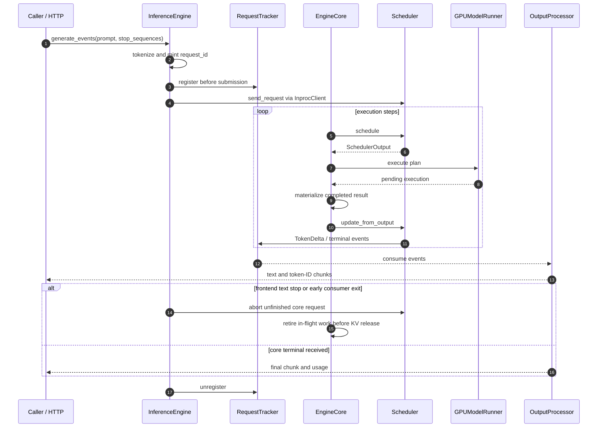

# Event Flow and Request Lifecycle

`core/events.py` is the progress/termination contract between the core and
frontend. `contracts.py` is the separate plan/result contract between the
core and worker. Neither contract carries a mutable core `Request`.

## One online generation

The frontend registers before admission, so fast rejection and zero-output
completion cannot race ahead of consumer setup. Detokenization, text stop
matching and protocol formatting run on the consumer side rather than in
model execution.

## Terminal contract

| Event | Meaning | Terminal |
|-------|---------|----------|
| `TokenDelta` | One accepted generated token with its sequence number | No |
| `RequestFinished` | Completion reason and token usage | Yes |
| `RequestError` | Error code, message and retryability | Yes |

Finish reasons include `stop_token`, `length`, `cancelled`, `aborted` and
`rejected`. Protocol adapters translate them to their own vocabularies.

For each admitted request:

- Accepted token events are ordered and delivered once.
- Exactly one terminal event follows them, including cancellation while
  waiting, cancellation while running, empty output, rejection and failure.
- Draining a pending execution at a batch change uses the normal result/event
  path. It cannot update token counts without delivering the corresponding
  accepted token events.
- A terminal state cannot be followed by another accepted token or a second
  terminal state. Already-submitted speculative pipeline work is retired,
  but its unnecessary result is not appended.
- KV/request slots are released only when their in-flight execution is safe
  to retire. A terminal event and GPU resource retirement are related but
  distinct milestones.

The request tracker marks terminal state before making the terminal event
observable to a consumer. Duplicate terminal delivery is ignored defensively,
but the core remains responsible for correct event production.

## Frontend stop is not core completion

A text stop sequence may be detected before the core's token/length stop.
The frontend must abort the unfinished core request even though its own
`OutputProcessor` is already finished. The same rule applies to early iterator
closure, disconnect and consumer exceptions. A naturally finished core
request does not need another abort.

Stop matching buffers only the ambiguous suffix. A one-character stop has
no ambiguous suffix; a natural token/EOS/length terminal flushes any remaining
unmatched text instead of dropping it. Prompt usage is known from the input
before the first token, including when a text stop completes the frontend
before a core terminal is consumed.

## Shutdown and synchronous callers

The driver signals shutdown and joins without holding the lock required by
the loop. If joining times out, the live thread and its state remain owned;
restarting over that thread is forbidden. Successful shutdown retires all
pending executions before freeing KV and terminating the remaining requests.

`run_batch` uses the same plan/result state-application rules but returns
structured token/logprob results directly; it does not detokenize through the
frontend. `score_ids` runs under the same operation boundary. Active online
requests are not interleaved with an independent synchronous run on shared
workspace/KV state.

Legacy callbacks remain adapters of core events. They are not a separate
cancellation/termination authority. The HTTP frontend uses the queue sink;
blocking generation collects after completion, and streaming generation
consumes incrementally.
