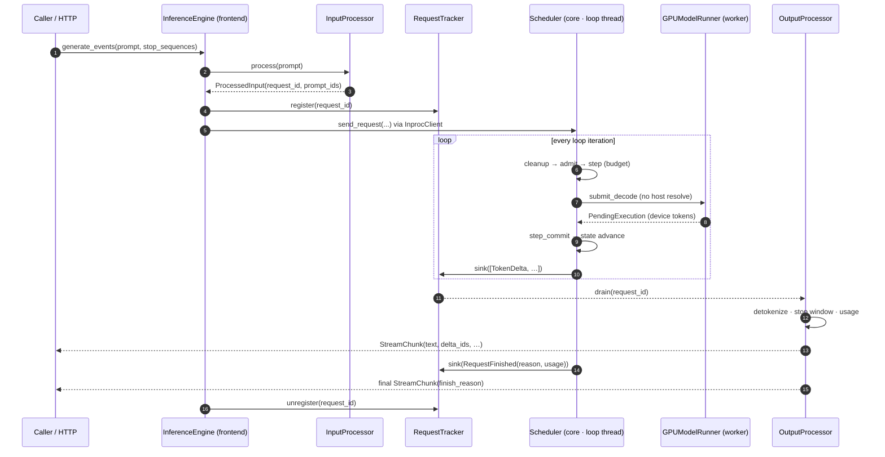
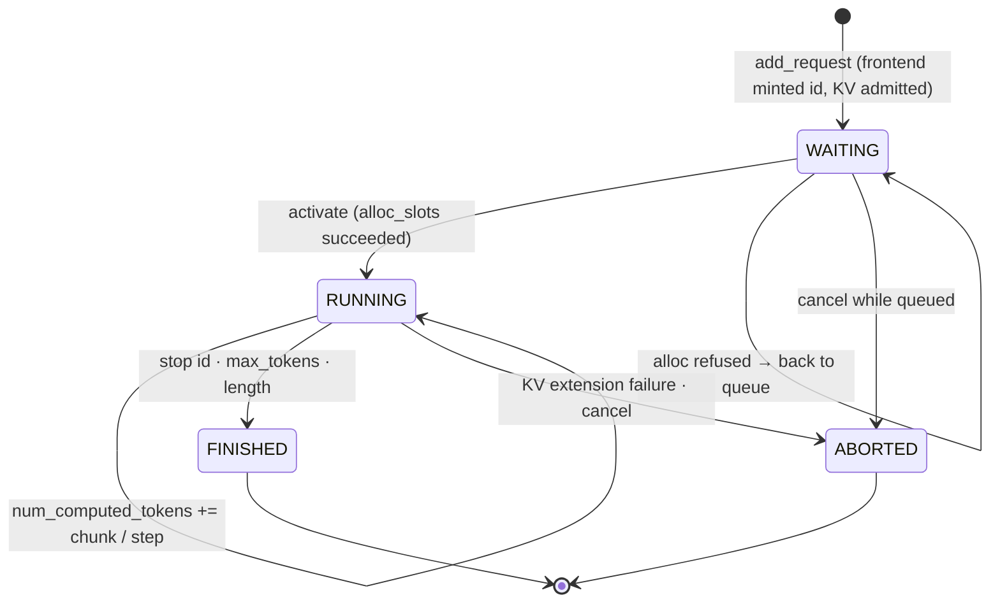

# Event Flow and Request Lifecycle

The event contract (`core/events.py`) is the only channel the scheduler
loop uses to report progress. This page shows the flow end-to-end and
the state machines it drives.

## One online generation, end to end

Key property: the loop thread only ever **appends events to queues**
(`_EventQueueSink.__call__` is a bucket-append under one lock). All
consumer work — detokenization, stop matching, protocol formatting, user
callbacks — runs where the queue is drained. A sink exception is caught
by `_emit_events` and logged; the loop keeps running.

## Request state machine

`num_computed_tokens` is the single scheduling state variable (the vLLM
model). Prefill chunks advance it by the chunk length (only the final
chunk samples); decode steps advance it by one. It always runs ahead of
`output_tokens` by at most one in-flight step — that gap is the
optimistic-advance window, and `step_commit` is its only correction
point.

## Event taxonomy

| Event | Meaning | Terminal |
|-------|---------|----------|
| `TokenDelta(request_id, token_id, sequence_no)` | one committed output token | no |
| `RequestFinished(request_id, finish_reason, prompt_tokens, completion_tokens)` | success termination | yes |
| `RequestError(request_id, error_code, message, retryable)` | failure termination | yes |

Finish reasons: `stop_token`, `length`, `cancelled`, `aborted`,
`rejected` — protocol-neutral; the OpenAI/Anthropic adapters map them
onto their own vocabularies. Every request ends with exactly one
terminal event, emitted after all of its `TokenDelta` events.

## Legacy bridge

Consumers that registered plain or batched stream callbacks (the
pre-event protocol) are served by `_CallbackBridge`, the default sink:
it detokenizes per request (sink side, not the loop's emission code) and
delivers `(request_id, text)` batches, terminal events becoming the
`STOP` sentinel. `run_batch`/`score` bypass the event stream entirely —
they drive the executor on the calling thread for RL rollout.

## Design-pattern view

| Pattern | Where | Why |
|---------|-------|-----|
| Facade | `InferenceEngine`, `KVCacheManager` | one entry surface each |
| Strategy | `EngineCoreClient`/`InprocClient`, `AllocationStrategy`, sampling chain | swap deployment/allocation/sampling without touching callers |
| Observer (push) | `OutputEventSink` outlet, queue sink, callback bridge | consumers off the producer thread; T1 swaps the sink for a transport |
| Command | `PendingExecution` submit/commit | deferred, idempotent execution; the seam for overlap |
| Flyweight | `InferenceWorkspace` | fixed-address buffers, CUDA-graph capture |
| Guard | `PolicyVersionGuard` | weight publication protocol |
| Memento | `RequestCacheState` | allocation snapshot, rollback on failed admission |

Deliberately absent: plugin registries/abstract factories (30-backend
scale not reached), mixin towers (SGLang's lesson), and a process
boundary at the engine core (would break `PolicyVersionGuard`'s shared
model object).
