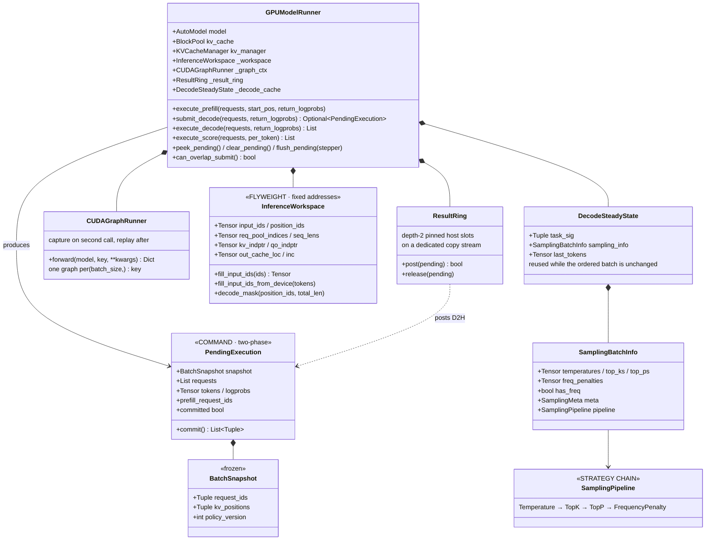

# Worker Layer

`astrai/inference/worker/` — model execution only (vLLM analogue: the
Worker process's `GPUModelRunner`; here in-process). Worker code does
not import request-lifecycle types: its only core dependency is a
`TYPE_CHECKING` reference for the KV manager's `bind()` interface.

## Classes

## The submit/commit contract

Decode runs as two phases (the vLLM `execute_model` / `sample_tokens`
split):

- **`submit_decode`** launches forward + sampling without resolving a
  single device value on the host and returns a `PendingExecution`
  holding device-resident tokens. Nothing here mutates request output
  state. KV positions advance at submit time (the write slot is a
  property of the launched work, which is what lets the next submit
  overlap the previous step).
- **`commit()`** is the single sanctioned host materialization point:
  it waits the posted copy event (async path via `ResultRing` on a
  dedicated copy stream) or falls back to `tolist()`, then appends
  tokens/logprobs. Idempotent — abort paths may call it defensively.

Tokens from the previous step stay on device
(`DecodeSteadyState.last_tokens`); a matching batch signature fills the
next step's `input_ids` device-to-device, so steady decode never
round-trips token ids through the host.

## CUDA graphs

`CUDAGraphRunner` captures one graph per `(batch_size,)` key: first call
at a key warms up, second captures (after a drain), subsequent calls
replay. All tensor arguments must live at stable addresses — that is the
`InferenceWorkspace` contract: per-step buffers are allocated once at
init and sliced per step, with host staging through pinned buffers.
Sampling runs outside the graph (it consumes mutable RNG state).

## Known gaps

Scheduling-level work still open in this layer's callers: chunked
prefill windows (`execute_prefill` currently takes one shared `start_pos`
and runs the whole remaining prompt) and the token budget that would cap
per-step forward tokens. See the repo-root design document's [A] items.
